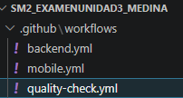
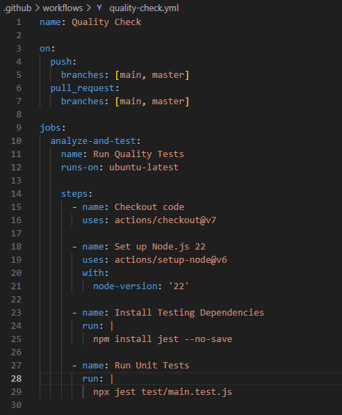
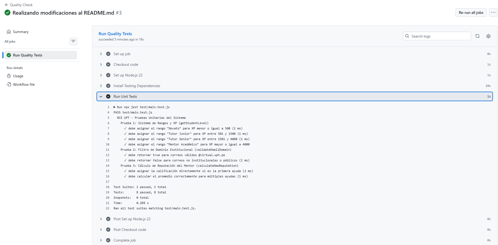

# INFORME DE EVALUACIÓN Y AUTOMATIZACIÓN – UNIDAD III

## 📝 Datos de Identificación
* **Curso:** Desarrollo de Aplicaciones Móviles
* **Fecha:** 23 de Junio de 2026
* **Estudiante:** Joan Cristian Medina Quispe
* **Código:** 2022074255
* **Repositorio de GitHub:** [SM2_ExamenUnidad3](https://github.com/JMedina255/SM2_ExamenUnidad3.git)

---

## 📸 Evidencias del Sistema (Capturas de Pantalla)

### A. Estructura de carpetas `.github/workflows/`
A continuación se adjunta la estructura de directorios del proyecto evidenciando los archivos de configuración de workflows de GitHub Actions para el backend, la aplicación móvil y el chequeo de calidad:

### B. Contenido del archivo `quality-check.yml`
Captura que muestra la configuración final del pipeline de control de calidad unitaria utilizando las últimas versiones de las acciones oficiales y Node.js 22:

### C. Ejecución del workflow en la pestaña Actions
Evidencia de la correcta ejecución del pipeline `Quality Check` en GitHub Actions, corriendo exitosamente las 8 pruebas unitarias sin advertencias (warnings) de deprecación:

---

## 🛠️ Explicación de lo Realizado

### 1. Estructura de Pruebas Unitarias (`test/main.test.js`)
El pipeline ejecuta Jest sobre el suite de pruebas en el archivo `test/main.test.js`, el cual valida tres pilares funcionales de la Red Colaborativa Estudiantil (RCE):

1. **`getStudentLevel(xp)` (Nivelación por XP):** Comprueba que a los usuarios se les asigne correctamente su rango correspondiente (*Novato, Tutor Junior, Tutor Senior, o Mentor Académico*) según la experiencia acumulada, verificando límites exactos y casos frontera.
2. **`validateEmailDomain(email)` (Filtro Institucional):** Bloquea el acceso a correos que no pertenezcan al dominio universitario oficial de la UPT (`@virtual.upt.pe`), validando también correos vacíos o nulos.
3. **`calculateNewReputation(currentReputation, totalHelps, newStars)` (Reputación Ponderada):** Realiza un cálculo ponderado de estrellas (1-5) cuando un alumno califica a su mentor al terminar una mentoría. Se comprueba tanto la primera ayuda (calificación directa) como el recálculo correcto con múltiples ayudas previas.

### 2. Proceso Paso a Paso de la Sesión de Desarrollo
El flujo de desarrollo y automatización realizado durante esta sesión de trabajo se estructuró en las siguientes fases secuenciales:

#### 📂 1. Creación del archivo de Workflow (`quality-check.yml`)
* Se configuró el archivo de integración continua [.github/workflows/quality-check.yml](.github/workflows/quality-check.yml) con las directivas de GitHub Actions para automatizar el pipeline.
* Se establecieron los disparadores automatizados para eventos de `push` y `pull_request` sobre las ramas `main` y `master`.
* Se definieron los pasos necesarios para descargar el código, configurar Node.js, instalar dependencias de prueba de forma aislada y ejecutar las pruebas de calidad automáticamente.

#### 🧪 2. Creación del Directorio de Pruebas y Código de Tests (`test/main.test.js`)
* **Organización:** Se creó la carpeta contenedora [test/](test/) en la raíz del proyecto para centralizar las verificaciones de calidad de software.
* **Pruebas Unitarias:** Se desarrolló el archivo [test/main.test.js](test/main.test.js) que implementa las funciones lógicas clave del sistema y su batería de pruebas unitarias implementadas en Jest (XP/Rangos, dominio de correo institucional y promedio ponderado de reputación).

#### ⚙️ 3. Configuración, Verificación y Corrección en GitHub Actions
* **Pruebas en la nube:** Se subieron los archivos al repositorio remoto y se verificó su correcta ejecución en la pestaña *Actions* de GitHub.
* **Corrección de Advertencias (Deprecación de Node 20):** Se detectó que el pipeline emitía un aviso crítico de deprecación de Node 20. Para optimizarlo y asegurar compatibilidad futura, se actualizaron las versiones de todas las acciones del flujo:
  * **Actualización de Actions oficiales:**
    * `actions/checkout` $\rightarrow$ Actualizado de `@v4` a **`@v7`** (mejoras de seguridad en forks y PRs).
    * `actions/setup-node` $\rightarrow$ Actualizado de `@v4` a **`@v6`** (soporte nativo para Node 24).
    * `actions/setup-python` $\rightarrow$ Actualizado de `@v5` a **`@v6`** (en el pipeline del backend).
    * `actions/setup-java` $\rightarrow$ Actualizado de `@v4` a **`@v5`** (en el pipeline de la app móvil).
  * **Actualización del Runtime de Node.js:** Se modificó la versión de ejecución de Node.js de `20` a **`22` (LTS)** dentro de los archivos `quality-check.yml` y `mobile.yml`, eliminando advertencias y garantizando un pipeline rápido y libre de advertencias de obsolescencia.

#### 📝 4. Edición del Archivo README.md y Consolidación de Documentos
* **Unificación de Documentación:** Todo el contenido técnico anterior del archivo `README.md` (arquitectura, base de datos, guías de configuración y despliegue del backend/mobile) se consolidó y estructuró en la [Documentación Maestra (DOCUMENTACION_PROYECTO.md)](DOCUMENTACION_PROYECTO.md), actualizando además el árbol de directorios a la nueva estructura raíz.
* **Generación del Informe Final:** El archivo [README.md](README.md) se renovó para servir como el informe oficial presentado para la Unidad III, conteniendo los datos de identificación, enlaces al repositorio, capturas de pantalla de evidencias (almacenadas de forma limpia en la ruta [docs/screenshots/](docs/screenshots/)), y este desglose cronológico de tareas de desarrollo.

---

## 📖 Documentación Adicional
Toda la información del diseño del proyecto, temática de gamificación, hoja de ruta, diagramas de arquitectura y despliegue rápido se encuentran unificados y detallados en la [Documentación Maestra del Proyecto](DOCUMENTACION_PROYECTO.md).
